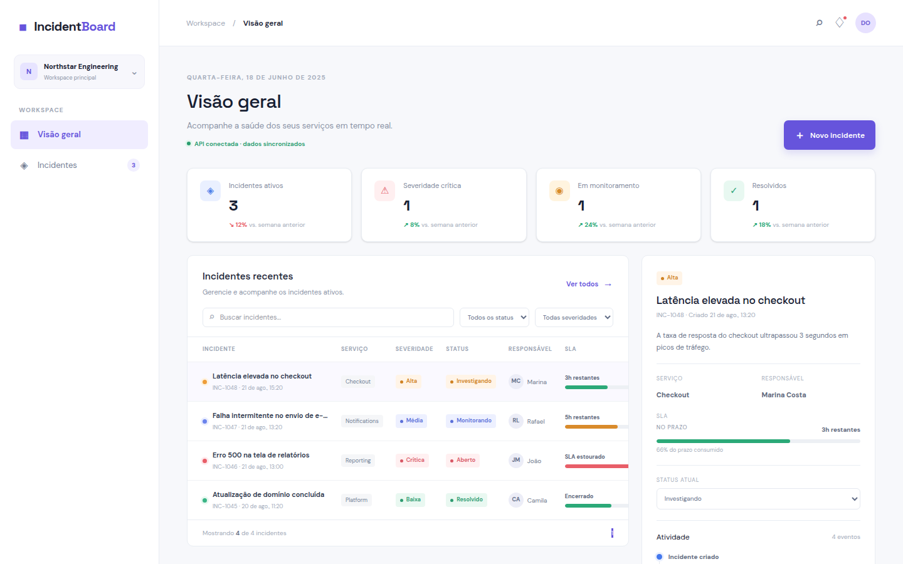
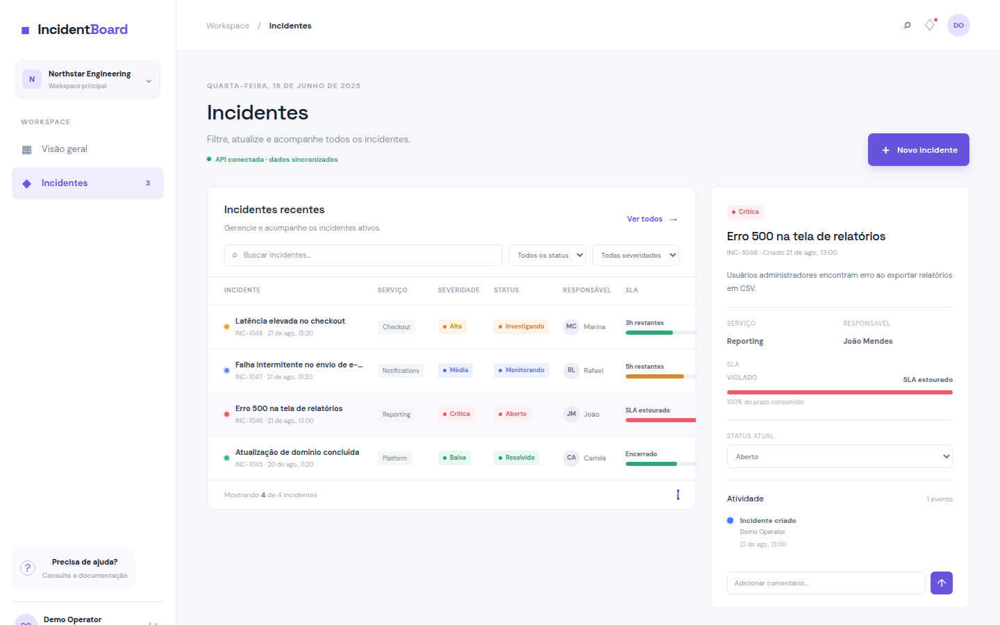

# IncidentBoard

O IncidentBoard é um dashboard operacional para equipes de engenharia registrarem, priorizarem e acompanharem incidentes técnicos. O projeto modela um fluxo de gerenciamento de incidentes com severidade, status, visibilidade de SLA, responsáveis, comentários e histórico de atividade.

> **Projeto de portfólio:** a versão atual demonstra modelagem de domínio, TypeScript full-stack, autenticação, persistência relacional, regras de negócio, interface responsiva, testes automatizados e CI.

## Prévia



As capturas abaixo foram geradas localmente com dados sintéticos, sem deploy público e sem informações reais. O GIF percorre o login, o dashboard e o detalhe de um incidente com SLA e atividade auditável.


| Tela | O que demonstra |
|---|---|
|  | Autenticação e acesso de demonstração local. |
|  | Métricas, filtros, tabela de incidentes e indicadores de SLA. |
|  | SLA violado, transição de status e timeline de atividade. |

A API local é iniciada como um processo separado do frontend. As credenciais de demonstração existem somente para desenvolvimento local e nunca devem ser reutilizadas em produção.

## Principais capacidades

- Dashboard com métricas de incidentes ativos, críticos, monitorados e resolvidos.
- Busca e filtros por status e severidade.
- Criação de incidentes com validação de payload.
- Controle de status, severidade, serviço, responsável e SLA.
- Detalhes do incidente com comentários e histórico.
- Persistência em PostgreSQL 17 com Drizzle ORM e migrations versionadas.
- Autenticação JWT com access tokens curtos e refresh tokens rotativos.
- Controle de acesso baseado em papéis, com `admin`, `operator` e `viewer`.
- Recuperação de senha local, com token exposto somente fora de produção.
- API REST para health check, usuários, autenticação e operações de incidentes.

## Arquitetura

A aplicação é organizada em um frontend React e uma API Express. A API isola a persistência e as regras de domínio, enquanto o PostgreSQL é a única camada de persistência em runtime. O Drizzle ORM gerencia o schema e as migrations. O Docker Compose fornece uma instância reprodutível do PostgreSQL 17 para desenvolvimento local.

```text
React 19 + TypeScript + Vite + React Router + Zustand + Tailwind CSS v4
                              |
                              v
                   Express 5 + JWT + controle de acesso
                              |
                              v
                   Drizzle ORM + PostgreSQL 17 via Docker
```

O frontend não persiste incidentes localmente. Se o PostgreSQL ou a API estiver indisponível, a aplicação informa o problema de conexão em vez de alternar silenciosamente para SQLite ou `localStorage`.

## Stack tecnológica

| Área | Tecnologias |
|---|---|
| Frontend | React 19, TypeScript, Vite, React Router, Zustand, Tailwind CSS v4 |
| Backend | Node.js, Express 5, TypeScript |
| Persistência | PostgreSQL 17, Drizzle ORM, migrations SQL versionadas |
| Runtime local | Docker Compose |
| Qualidade | Vitest, Supertest, Testing Library, ESLint, build TypeScript |
| Segurança | JWT, rotação de refresh token, controle de acesso, bcrypt e segredos por ambiente |
| Integração contínua | GitHub Actions com PostgreSQL, migrations, lint, testes e build |

## Execução local

### Requisitos

- Node.js 20 ou superior.
- npm 10 ou superior.
- Docker Desktop instalado e em execução. O PostgreSQL é obrigatório para a API.

### Instalação e inicialização

No PowerShell:

```powershell
git clone https://github.com/osacra/incidentboard.git
cd incidentboard
npm install
Copy-Item .env.example .env
npm run dev
```

O comando `npm run dev` inicia o PostgreSQL via Docker Compose, aplica as migrations do Drizzle e inicia a API e o frontend. O frontend fica normalmente em `http://localhost:5173` e a API em `http://localhost:3001`.

Em Linux ou macOS, o equivalente para copiar o arquivo de ambiente é:

```bash
cp .env.example .env
```

Para executar as etapas separadamente:

```powershell
npm run db:up
npm run db:migrate
npm run dev:api
```

O comando `npm run dev:api` executa novamente a preparação do banco antes de iniciar a API. Por isso, no desenvolvimento normal, basta usar `npm run dev`; não é necessário executar `db:setup` manualmente antes dele.

As variáveis estão documentadas em `.env.example`. Nunca versione credenciais reais ou segredos de produção.

### Validação

A validação rápida não precisa de banco e verifica lint, testes isolados e build:

```powershell
npm run lint
npm run test
npm run build
```

Os testes da API usam PostgreSQL. Com Docker em execução e o arquivo `.env` configurado, execute:

```powershell
npm run test:integration
```

Esse comando sobe o PostgreSQL, aplica as migrations e executa os testes do backend. Para executar somente os testes da API contra um banco já preparado, use `npm run test:api`.

O mesmo fluxo de banco, lint, testes e build é executado automaticamente pelo GitHub Actions em cada pull request para `main`.

## API

| Método | Endpoint | Finalidade |
|---|---|---|
| `GET` | `/api/health` | Verificar disponibilidade básica da API. |
| `GET` | `/api/health/live` | Verificar se o processo está vivo. |
| `GET` | `/api/health/ready` | Verificar se a API consegue acessar o PostgreSQL. |
| `GET` | `/api/incidents` | Listar incidentes autenticados. |
| `GET` | `/api/incidents/:id` | Consultar um incidente. |
| `POST` | `/api/incidents` | Criar incidente como `admin` ou `operator`. |
| `PATCH` | `/api/incidents/:id` | Atualizar incidente como `admin` ou `operator`. |
| `POST` | `/api/incidents/:id/comments` | Adicionar comentário. |
| `POST` | `/api/auth/login` | Autenticar usuário local. |
| `POST` | `/api/auth/refresh` | Rotacionar refresh token. |
| `POST` | `/api/auth/logout` | Revogar refresh token. |
| `POST` | `/api/auth/forgot-password` | Gerar recuperação local. |
| `POST` | `/api/auth/reset-password` | Redefinir senha. |
| `GET` | `/api/users` | Listar usuários para administradores. |
| `PATCH` | `/api/users/:id/role` | Alterar papel de usuário. |
| `GET` | `/api/auth/me` | Validar a sessão atual. |

## Operação e segurança

A API envia um `X-Request-Id` em cada resposta para facilitar rastreamento nos logs. O endpoint `/api/health/live` indica somente que o processo está vivo, enquanto `/api/health/ready` valida também a conexão com o PostgreSQL e retorna `503` quando a dependência não está disponível. O CORS aceita a origem definida em `CORS_ORIGIN`, cujo padrão local é `http://localhost:5173`. O login possui rate limit por IP em ambientes não relacionados a testes, reduzindo tentativas automatizadas sem tornar a suíte de integração dependente de estado global.

## Sessões e autorização

O login emite um access token JWT de curta duração e um refresh token opaco armazenado com hash no PostgreSQL. O frontend renova automaticamente a sessão quando uma chamada autenticada retorna `401`. Refresh tokens são rotacionados a cada uso e podem ser revogados no logout.

A API possui três papéis: `admin`, `operator` e `viewer`. A leitura de incidentes exige autenticação; criação, edição, alteração de status e comentários exigem `admin` ou `operator`. O papel `viewer` fica restrito à leitura. Em produção, o segredo JWT deve ser longo, aleatório e fornecido exclusivamente por variável de ambiente.

## Troubleshooting

Se aparecer `failed to connect to the docker API` ou `dockerDesktopLinuxEngine`, o Docker Desktop não está em execução ou ainda não terminou de inicializar. Abra o Docker Desktop, aguarde o status da engine ficar pronto e confirme com:

```powershell
docker version
docker compose ps
```

Depois, execute novamente:

```powershell
npm run dev
```

Se aparecer `DATABASE_URL não configurada`, crie o `.env` com `Copy-Item .env.example .env`. Se a migration apresentar conexão recusada, confirme que o container está saudável com `docker compose ps` e que a porta 5432 não está sendo usada por outro PostgreSQL local.

## Testes e decisões de engenharia

A suíte é dividida entre testes isolados de frontend e testes de integração da API. Os testes de backend usam PostgreSQL real, migrations versionadas e seed idempotente, evitando mascarar problemas de compatibilidade com uma persistência diferente da usada em runtime. Os tipos de domínio estão centralizados em `src/types.ts`, enquanto persistência e regras de negócio ficam isoladas da UI. O projeto utiliza Conventional Commits e não mantém arquivos de banco local versionados.

As principais decisões e os trade-offs estão documentados em [`docs/technical-decisions.md`](docs/technical-decisions.md). Esse documento também reúne perguntas prováveis de entrevista sobre PostgreSQL, autorização, auditoria, SLA, testes e operação.

## Limitações e próximos passos

O PostgreSQL é obrigatório em runtime; não existe fallback para SQLite. A recuperação de senha atualmente é local e expõe o token somente em ambiente não produtivo, para permitir teste manual sem configurar um provedor de e-mail.

Os próximos incrementos recomendados são entrega de e-mail para recuperação em produção, convite de usuários, observabilidade, notificações, webhooks, paginação, ordenação, exportação de relatórios e deploy automatizado na plataforma escolhida.
